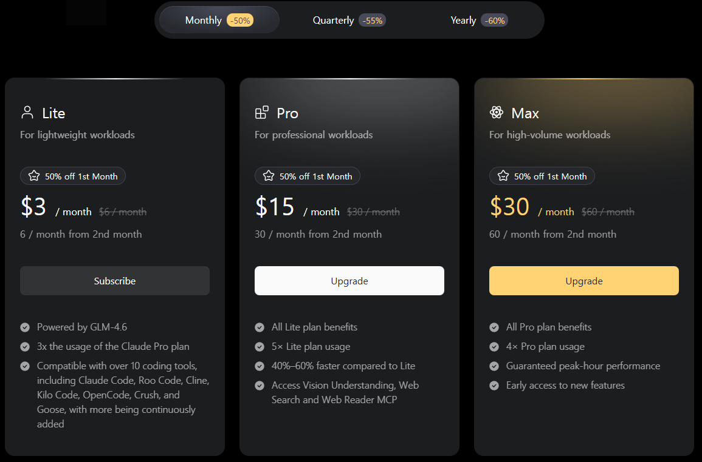
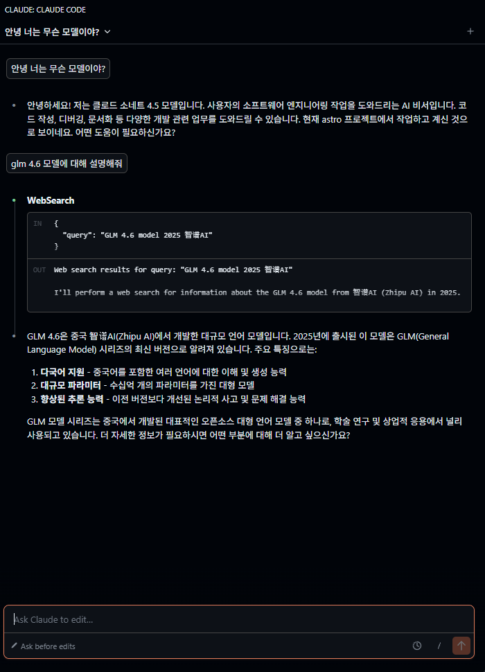
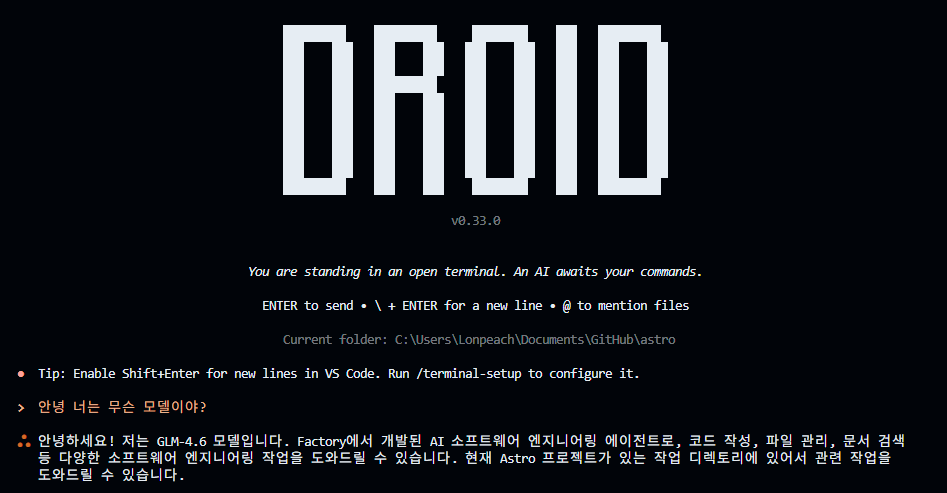
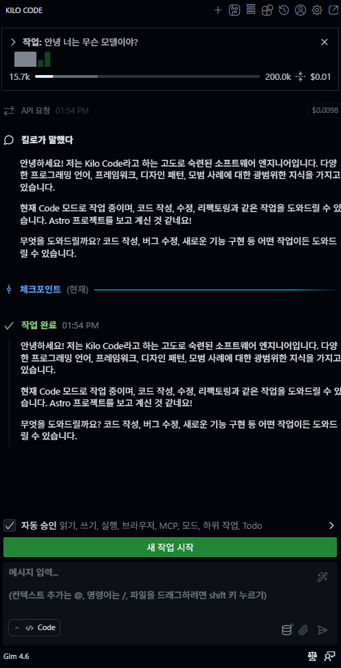
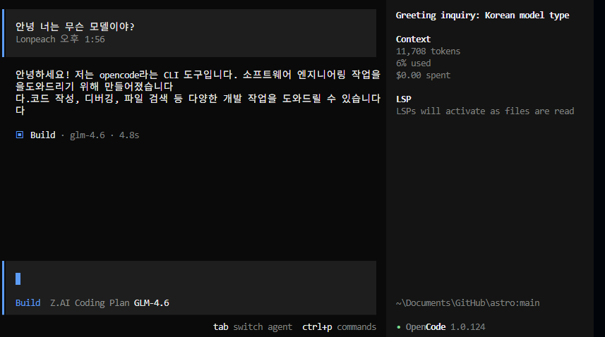

## 1. 왜 GLM 4.6을 선택했나

요즘 AI 코딩 도구들이 쏟아지고 있다. Claude, GPT, Gemini 등 선택지가 많지만, 비용이 부담되는 건 사실이다.  
그러던 중 Z.AI의 GLM 4.6 Lite 플랜을 발견했다. **월 3달러** 라는 가격에 웹 서치, 이미지 분석 MCP까지 제공한다니 일단 써보기로 했다.

12월 10일 기준으로 다시 확인해보니, Lite 플랜에서도 웹 서치와 이미지 분석 MCP를 제공하고 있었다.  
내 수준에서는 충분히 사용 가능한 분량으로 보였고, 적용 가이드도 잘 되어 있어서 진입 장벽이 낮았다.

**플랜별 MCP 쿼터:**

| 플랜 | 웹 서치 + 웹 리더 | 비전 이해 |
|------|-------------------|-----------|
| Lite | 100회 | 5시간 |
| Pro | 1,000회 | 5시간 |
| Max | 4,000회 | 5시간 |

내 수준에서는 Lite의 100회로도 충분해 보였다.

25년 12월 말에 GLM 5.0이 나온다고 하니, 만족스러우면 1년 결제도 고려해볼 만하다.

## 2. 결제 및 설정



결제는 [Z.AI 구독 페이지](https://z.ai/manage-apikey/subscription)에서 진행했다.  
12월 1일에 3개월 결제를 한 상태 여러가지 이벤트등을 적용해 **6.5달러** 정도에 결제했다.

API 키를 발급받은 후, 여러 도구에 연결해봤다:
- Cursor에 API 키 연결
- Factory Droid API 키 연결
- Crush API 키 연결
- VS Code 확장에 API 키 연결

## 3. Claude Code와 MCP 연동

내 생각에 Claude Code가 업계 표준이 되어가는 것 같아서, Claude Code 기준으로 세팅했다.



### MCP 설치 명령어

```bash
# Z.AI MCP 서버 추가
claude mcp add -s user zai-mcp-server \
  --env Z_AI_API_KEY=YOUR_API_KEY \
  --env Z_AI_MODE=ZAI \
  -- npx -y "@z_ai/mcp-server"

# 웹 서치 MCP 추가
claude mcp add -s user -t http web-search-prime \
  https://api.z.ai/api/mcp/web_search_prime/mcp \
  --header "Authorization: Bearer YOUR_API_KEY"

# 웹 리더 MCP 추가
claude mcp add -s user -t http web-reader \
  https://api.z.ai/api/mcp/web_reader/mcp \
  --header "Authorization: Bearer YOUR_API_KEY"
```

### 권한 설정 관련

MCP를 사용할 때마다 권한을 물어보는 게 번거로웠다. 설정 파일에서 `allowedTools` 등을 조정해볼 수 있지만, 아직 완벽하게 동작하지 않는 부분이 있어서 추가 확인이 필요하다.

### 함께 사용하면 좋은 MCP들

Sequential Thinking, Context7, Filesystem, GitHub 등 다양한 MCP와 함께 사용하면 더 강력해진다.  
MCP 구성에 대한 자세한 내용은 별도 글로 정리할 예정이다.

공식 가이드 참고:
- [Vision MCP Server](https://docs.z.ai/devpack/mcp/vision-mcp-server)
- [Search MCP Server](https://docs.z.ai/devpack/mcp/search-mcp-server)
- [Reader MCP Server](https://docs.z.ai/devpack/mcp/reader-mcp-server)

## 4. 10일간 사용 후기

### 전반적인 인상

- **비용 대비 만족도**: 3달러라서 쓰는 것 같다. 그 이상이면 고민했을 듯.
- **사용량**: 3달러 요금제에서도 상당히 넉넉하다. 사용량 부족을 느낀 적 없음.

### 도구별 평가







| 도구 | 평가 |
|------|------|
| **[Droid](https://github.com/anthropics/droid)** | 사용성 괜찮음. 추천 |
| **[Crush](https://github.com/charmbracelet/crush)** | 터미널 기반 AI 도구. UI가 이쁨 |
| **Claude Code** | 너무 느림. TODO 리스트를 과하게 작성하는지 체감 속도가 답답함 |
| **Kilo Code (VS Code 확장)** | 첫 느낌 괜찮음. 웹 서치 연동 방법은 더 알아봐야 함 |

### 웹 검색 관련 삽질기

처음에는 Lite 플랜에서 웹 서치가 안 되는 줄 알았다. 플랜 설명에 명확하게 나와있지 않아서 외부 검색 API(Tavily 등)를 연동해야 하나 고민했다.

그런데 나중에 알고 보니 **Z.AI에서 제공하는 웹 서치 MCP도 Lite 플랜에서 사용 가능**했다.  
위에서 소개한 `web-search-prime`, `web-reader` MCP가 바로 그것이다.

결론적으로:
- Z.AI 웹 서치 MCP: Lite 플랜에서도 사용 가능 (100회 제공)
- [Tavily](https://tavily.com/): 월 1,000회 무료, 카드 등록 불필요 – 대안으로 괜찮음

처음부터 알았으면 삽질을 덜 했을 텐데, 이런 것도 경험이라 생각한다.

## 5. 솔직한 고민들

### 속도 문제

Claude Code 연결은 해뒀는데, 뭔가 애매하다. 모델도 정확하지 않고...  
일단 돌아가긴 하니까 사용은 하는데, 돈 나가는 건 아닌지 좀 무섭다.  
속도가 너무 느린 것 같은데, 원래 이런가? 예전엔 이 정도까진 아니었던 것 같은데...

### 앞으로의 계획

여러 도구를 테스트해본 결과, **Claude Code로 정착**하기로 했다.  
앞으로는 Claude Code + GLM 4.6 조합에서 실제 성능 테스트를 진행하고, MCP 활용법을 더 깊이 연구해볼 예정이다.

## 6. 결론

**3달러라는 가격에 이 정도면 충분히 가성비 있다.**

특히 Droid와의 조합이 괜찮았고, MCP를 활용한 웹 서치 연동도 재미있는 경험이었다.  
Claude Code는 속도 문제만 해결되면 좋을 것 같다.

GLM 5.0이 12월 말에 나온다고 하니, 그때 다시 평가해보고 1년 결제 여부를 결정할 예정이다.

AI 코딩 도구를 저렴하게 시작해보고 싶다면, GLM 4.6 Lite 플랜은 좋은 선택지가 될 수 있다.

**추천 대상:** 월 20달러 구독이 부담스럽지만 AI 코딩 도구를 본격적으로 써보고 싶은 개발자
