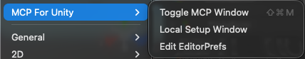
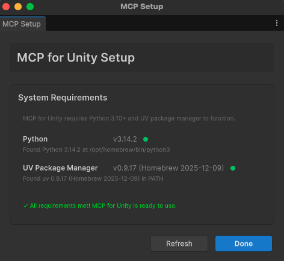
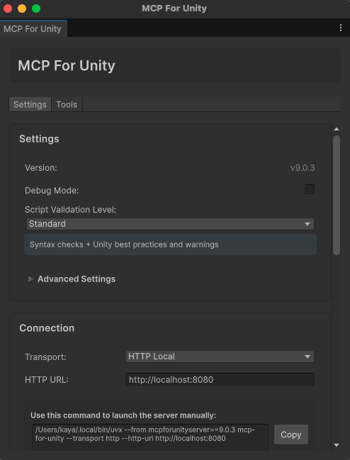

## 1. Unity MCP 소개

Unity 게임 개발을 원활하게 하기 위한 MCP(Model Context Protocol) 도구를 발견하고 테스트해보았다.

- **프로젝트**: [CoplayDev/unity-mcp](https://github.com/CoplayDev/unity-mcp)
- **목적**: Cursor와 같은 AI 에디터에서 Unity Editor를 직접 제어하여 게임 개발 자동화

Unity Editor와 AI 에이전트를 연결하여 자연어 명령으로 게임 오브젝트 생성, 스크립트 작성, 셰이더 적용 등의 작업을 자동화할 수 있다는 점이 흥미로웠다.

## 2. 설치 및 설정

### 사전 준비

- python 및 uv 설치 필요
- 에셋 스토어에서 공식적인 에셋으로 다운로드 가능하며, git을 통한 다운로드도 가능
- 에셋 스토어 방식이 더 편리하여 해당 방법으로 설치

### 설치 후 설정

설치 이후 Unity Editor 메뉴에서 별도 설정이 필요하다:
- `Window` → `MCP for Unity` → `Local Setup Window`
- `Window` → `MCP for Unity` → `Toggle MCP Window`

### Unity MCP 로컬 설정



필수적으로 설치되어야 하는 python 및 uv 설정을 확인할 수 있는 창이다. 모든 항목이 초록색이면 정상적으로 설정된 것이다.

### MCP 윈도우 토글



Unity Editor 내에서 MCP 윈도우를 토글하여 연결 상태와 로그를 확인할 수 있다.

**설정 방법:**
- **Connection**: HTTP Local을 선택하고, `http://localhost:8080` 설정 후 `Start Server` 버튼 클릭
- **Client Configuration**: 원하는 클라이언트(연결할 AI) 선택 후 확인
- `Configure All Detected Clients` 버튼을 클릭하면 컴퓨터에 설치된 모든 AI가 자동 설정된다

### OpenCode 설정 (비공식)

공식적으로 OpenCode를 지원하지 않지만, `opencode.json` 파일을 수정하여 연결 가능했다:

```json
"unityMCP": {
  "type": "remote",
  "url": "http://localhost:8080/mcp",
  "enabled": true
}
```

비공식 방법이지만 정상적으로 동작했다. 향후 OpenCode도 공식 지원이 추가되면 더 안정적으로 사용할 수 있을 것 같다.

## 3. 테스트 결과

테스트용으로 여러 명령어를 시도해보았다.

### 시도한 명령어들

- **"Create a 3D player controller"**: 3D 플레이어 컨트롤러 생성
- **"유니티로 게임 개발을 원활하게 하기 위해서 mcp 도구를 설치해봤어. 테스트용으로 여러 도구들을 테스트 겸 사용 해봐"**

### 실제 동작 경험

AI 에이전트가 Unity Editor를 제어하여 GameObject를 생성하고, C# 스크립트를 작성하고, 컴포넌트를 추가하는 과정을 자동으로 수행했다.

완벽한 자동화는 아닌 것 같지만, **MCP를 통해 AI가 확연히 Unity 엔진에 대한 이해도가 올라갔다는 부분을 확인할 수 있었다.**

## 4. 결론

Unity MCP는 게임 개발의 반복적인 작업을 자동화하는 데 큰 잠재력이 있다. 특히 프로토타이핑 단계에서 빠르게 아이디어를 테스트하거나, 보일러플레이트 코드를 생성하는 용도로 유용할 것 같다.

### 장점

- 자연어로 Unity Editor 제어 가능
- 반복 작업 자동화로 생산성 향상
- 프로토타입 빠른 생성

### 한계점

- 복잡한 로직은 여전히 수동 작업 필요
- 초기 설정이 다소 번거로움
- Unity 시작 시 MCP 사용하려면 `Start Server` 버튼을 항상 클릭해야 함 (번거로움)

게임 개발에서 AI 에이전트 활용 가능성을 확인했다는 점에서 의미 있는 테스트였다. 앞으로 Unity 프로젝트를 진행할 때 적극적으로 활용해볼 계획이다.
