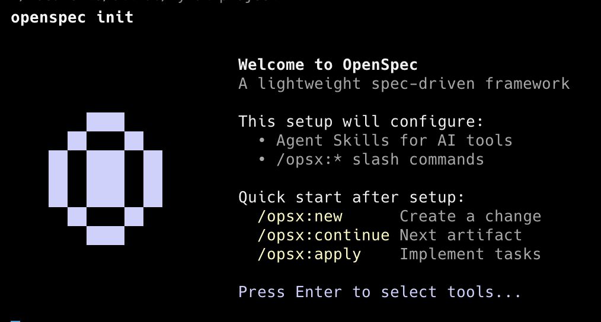
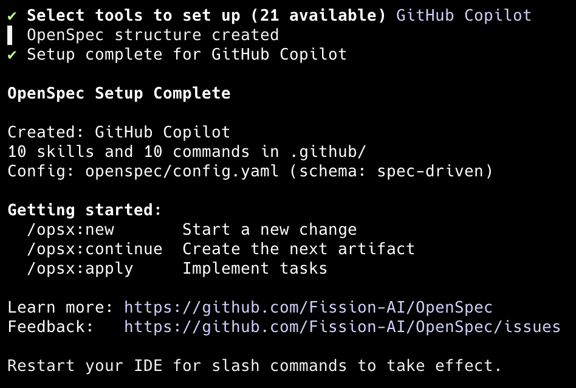
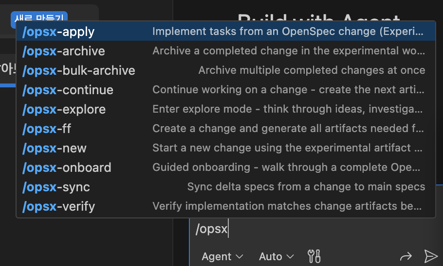

## 들어가며

사양 중심 개발 방법론(SDD, Specification-Driven Development)은 25년 하반기부터 주목받기 시작한 개발 방법론이다. AI 기술이 하루가 다르게 발전하면서 어떤 방법론이 대세가 될지 모르겠지만, 그래도 학습 난이도가 낮고 유명한 것들은 익혀두면 좋을 것 같다.

오늘은 SDD의 대표 도구인 [OpenSpec](https://github.com/Fission-AI/OpenSpec)을 직접 설치하고 써본 경험을 정리해봤다.

---

## OpenSpec이란?

OpenSpec은 **설계 문서를 기반으로 AI와 협업하는 도구**다. 코드를 바로 짜는 대신, 먼저 문서(제안서, 설계서, 작업 목록)를 만들고, 이 문서를 "진실의 원천(Source of Truth)"으로 삼아 AI가 구현하도록 하는 방식이다.

---

## 설치 및 초기 설정

### 1. 설치

```sh
# OpenSpec 최신 버전 글로벌 설치
npm install -g @fission-ai/openspec@latest
```

### 2. 프로젝트 초기화

```sh
openspec init
```



Enter 입력 후 사용할 도구를 선택한다. 나는 GitHub Copilot을 선택했다.



### 3. Copilot 연동 확인

초기화가 완료되면 GitHub Copilot Chat 창에 OpenSpec 명령어가 추가된 걸 확인할 수 있다.




> 💡 커스텀 프롬프트 외에 skills도 추가되는데, 내가 생각한 동작 방식과는 달랐다. skills 폴더를 명시적으로 확인하라는 명령을 따로 줘야 동작하는 듯하다.

---

## 핵심 워크플로우

OpenSpec의 기본 사용 흐름은 4단계로 정리된다.

| 단계 | 명령어 | 설명 |
|:---:|:---:|:---|
| 1 | `/opsx:new` | 기능 선언 및 작업 폴더 생성 |
| 2 | `/opsx:ff` | 설계 문서 일괄 생성 |
| 3 | (직접 수정) | 생성된 문서 검토 및 수정 |
| 4 | `/opsx:apply` | 확정된 설계대로 코드 구현 |

### 1단계. `/opsx:new [기능명]`

작업 폴더(`openspec/changes/[기능명]/`)를 생성하고, 기본 제안서(`proposal.md`) 초안을 만든다. AI가 다른 코드와 혼동하지 않도록 맥락을 격리하는 단계다.

### 2단계. `/opsx:ff` (Fast-Forward)

AI가 제안서를 바탕으로 한 번에 모든 설계 문서를 생성한다.

**생성되는 산출물:**
- `specs/` - 세부 요구사항과 테스트 시나리오
- `design.md` - 라이브러리, 데이터 구조, 컴포넌트 설계
- `tasks.md` - 구현을 위한 단계별 체크리스트

### 3단계. 검토 및 수정 (핵심!)

여기가 가장 중요한 부분이다. 생성된 `.md` 파일들을 직접 열어서 AI가 작성한 내용 중 내 의도와 다른 부분을 **직접 수정**한다.

예를 들어:
- "LocalStorage 대신 Firebase를 써줘"
- "이 작업은 3단계가 아니라 1단계에서 해야 해"

문서를 수정하고 저장하면, AI는 수정된 문서를 새로운 지침으로 받아들인다. 대화창에서 "설계를 이렇게 바꿔줘"라고 말해도 AI가 관련 문서를 알아서 업데이트한다.

### 4단계. `/opsx:apply`

확정된 `tasks.md`의 체크리스트를 하나씩 수행하며 실제 코드를 작성한다. 각 작업이 완료될 때마다 `[ ]`가 `[x]`로 바뀌며 진행 상황을 보여준다.

### (선택) `/opsx:archive`

모든 구현과 테스트가 끝나면 작업 폴더를 `archive/`로 이동시키고 종료한다.

---

## 모드 비교: `/opsx:ff` vs `/opsx:continue`

| 모드 | 방식 | 언제 쓰는가? |
|:---:|:---:|:---|
| `/opsx:ff` | 모든 문서를 **한 번에** 생성 | 기능이 명확하고 빠르게 시작하고 싶을 때 |
| `/opsx:continue` | **한 번에 하나씩** 단계별 생성 | 복잡한 기능, 단계별로 꼼꼼히 검토하고 싶을 때 |

> 💡 `/opsx:explore`라는 명령어도 있다. `/opsx:new`로 작업을 시작하기 전에 AI와 가볍게 아이디어를 주고받는 브레인스토밍 모드다.

---

## 마무리

### 👍 좋았던 점

- 코드보다 설계가 먼저라는 점이 마음에 든다
- 문서 수정만으로 AI 지시를 바꿀 수 있어서 편하다
- 작업 진행 상황이 체크리스트로 시각화된다

### 🤔 아쉬운 점

- Copilot skills 연동이 생각보다 직관적이지 않았다
- 작은 기능에는 오버헤드가 느껴질 수 있다

### 추천 대상

- AI 코딩 도구를 적극 활용하는 개발자
- 설계 문서 기반 협업에 익숙한 팀
- 복잡한 기능 구현 전 정리가 필요한 프로젝트

> OpenSpec은 **Opus 4.5**, **GPT 5.2** 같은 고성능 추론 모델에서 가장 잘 동작한다고 한다.
